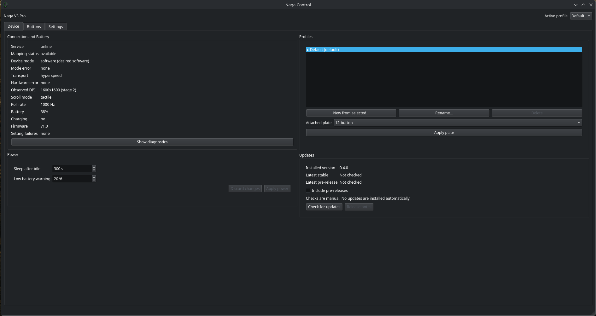
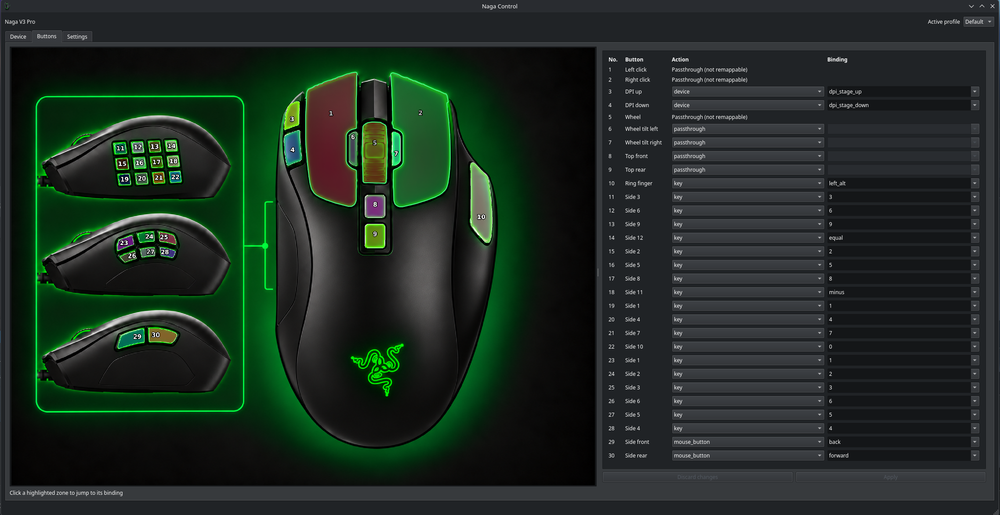
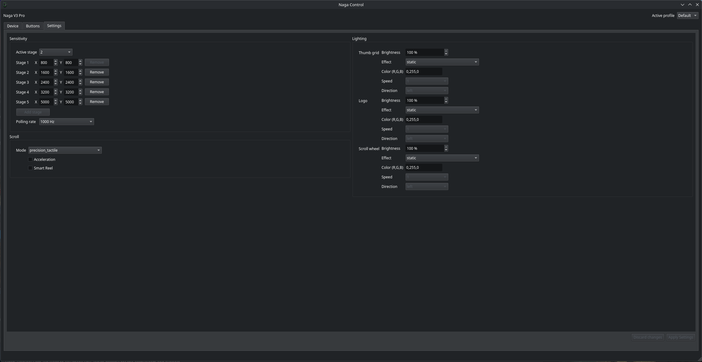

# Naga Control

Naga Control is a native Linux control service and Qt application for the
Razer Naga V3 Pro. It is intentionally limited to the wired `1532:00E7` and
HyperSpeed `1532:00E8` variants.

**This is a personal off-project.** It exists to support one specific mouse
on the maintainer's desktop, built as a best effort alongside other work.
There is no support commitment, no roadmap, and no guarantee of timely
fixes - issues and PRs are welcome but may sit. It works well for the
hardware and distro it was validated on (see
[hardware validation](docs/hardware-validation.md)); anywhere else you are
your own QA.

The goal is one coherent application for hardware settings and button
remapping, backed by OpenRazer, evdev, and uinput. It is not a generic Razer
frontend and it does not reimplement OpenRazer's HID protocol.

## Install

Requires an unprivileged Linux x86_64 desktop session, user systemd/session
D-Bus, FUSE2 library/runtime support, `curl`, `sudo`, and the standard tools
listed under [installer prerequisites](docs/troubleshooting.md#installer-prerequisites).
OpenRazer must already provide the [Naga baseline](docs/release-notes.md).
No missing OS prerequisites are automatically installed.
Managed service/desktop integration always requires FUSE; leave
`APPIMAGE_EXTRACT_AND_RUN` unset (or `0`). Extraction is manual launch-only,
not a supported FUSEless managed installation.

One command that preserves terminal stdin and pins **script, bootstrap ref and
artifact version** to the existing published v0.4.0 tag:

```bash
(umask 077; d=$(mktemp -d) && trap 'rm -rf "$d"' EXIT && trap 'exit 130' INT && trap 'exit 143' HUP TERM && curl -fsSL https://raw.githubusercontent.com/Rainexn0b/naga-control/v0.4.0/install.sh -o "$d/install.sh" && bash "$d/install.sh" --ref v0.4.0 --version v0.4.0)
```

The new safety behavior below belongs to **this checkout's installer**, not
retroactively to scripts published at v0.4.0 or other older tags. Review a
published tagged installer before using it. No future release is implied here.
To use the reviewed new installer from a checkout:

```bash
./install.sh --version v0.4.0
```

The ordinary install is **app-only**: it never offers, downloads, installs, or
replaces OpenRazer, and never changes its group or daemon. On experimental
Arch/pacman hosts, explicitly append `--install-openrazer` to the **same bash
command** in the one-liner (or use `./install.sh --version v0.4.0 --install-openrazer`
from a checkout). `NAGA_CONTROL_INSTALL_OPENRAZER=1` also opts in. This deliberately reinstalls
the whole pinned cohort, even at the same source/version (recipe metadata,
wrapper, or builder Python may have changed), with pacman's own prompts; read the
[prerequisite and rollback guidance](docs/release-notes.md#required-openrazer)
first. `NAGA_CONTROL_INSTALL_OPENRAZER=0` is a hard skip even with the flag;
other values (including an empty value) are errors.

Opt-in still needs a terminal for confirmation and pacman's own conflict
prompts. It validates the release manifest, hashes, source stamps, metadata,
and the system Python minor via isolated `/usr/bin/python3`, not a PATH/virtualenv
alias, before sudo, including active-kernel headers/build metadata and toolchain
checks.
The helper's read-only `--preflight` checks Python minimum, active-kernel headers,
tools and session connectivity **before Naga stop consent**. Helpers lacking this
mode fail closed for opt-in; ordinary app-only installs still need no helper.
Release archive/Python-minor validation happens separately before sudo; the
actual install repeats environment gates and keeps pacman's own prompts.
Activation is deferred: the user units are
enabled **without starting them**; reboot/re-login and verify OpenRazer before
starting Naga. The new app installer requires consent to gracefully stop a
running **Naga-only** service first; no OpenRazer/GUI processes are killed.
Other distributions
need a manual matching-source native build, not Arch packages; this is not a
promise of support for all Arch derivatives or for Debian/Fedora.

Uninstall:

```bash
./scripts/uninstall.sh --yes
```

The new installer verifies the exact release's canonical `.sha256` sidecar and
AppImage bytes **before execution, replacement, service stop or sudo**. Reused
local images are hashed too. Missing older-release checksums fail closed, with
no legacy fallback. HTTPS hashes detect corruption, not independent publisher
authenticity or signatures. Installation uses private temporary staging,
same-filesystem atomic replacement, and a stable per-user nonblocking lock.

For a running service, quit the GUI and release held controls before consenting
to the temporary remapping outage. No TTY/default refusal cancels safely;
`--restart-service` explicitly consents. Verified previous image/tag rollback
pairs are retained in `~/.local/share/naga-control/rollback.*`, including forced
same-version downloads; unchanged reinstalls preserve existing backups. Profiles
are untouched. See [upgrades and recovery](docs/troubleshooting.md#installer-upgrades-and-rollback).
Uninstall removes installer backups/stamps but retains the lock inode and
OpenRazer. Add `--purge-config` only if profile removal is intended.

App-only success enables/starts the user service; that is **not hardware
readiness**. OpenRazer opt-in or a failed udev reload leaves activation staged.
There is no broad udev trigger; replug the target mouse after rules reload.
After prerequisites are activated, inspect this read-only application snapshot
(the command can D-Bus-activate the service; the installer only prints it):

```bash
busctl --user call org.nagacontrol.Service1 /org/nagacontrol/Service1 org.nagacontrol.Service1 GetSnapshot
```

Require `status` = `available` and perform physical F13/F14 DPI-stage and F17
held-ALT down/up checks. These are not automatically established by installation.

## Status

The repository has hardware-independent coverage for read-only capture, strict
profile configuration, OpenRazer control, physical USB-parent discovery,
ordered frame parsing, proxy-before-grab activation, forwarding clones,
replacement outputs, session D-Bus, and the native Qt configuration UI. The
12-button first slice has passed on both wired and HyperSpeed hardware for
F13/F14 DPI stage changes and held F17-to-LEFTALT output. All 19 12-button
controls are captured and remapped on both transports - including verified
top buttons (`KPSLASH`/`F18`), scan-less wheel tilt, and the full thumb grid -
plus the 6- and 2-button plates on HyperSpeed. Motion, clicks, and
high-resolution wheel are validated through the forwarding proxies, and the
2-button plate validates virtual-mouse back/forward output. HyperSpeed daemon
restart, sleep/wake, receiver reconnect, disconnect-while-held cleanup, and a
live wired-to-HyperSpeed switch have also passed. The service now applies
desired DPI stages, scroll settings, power settings, poll rate, and all three
lighting zones to the hardware with per-setting failure reporting, and the
snapshot publishes observed DPI, scroll, poll-rate, battery, charging, and
firmware values for the GUI Device tab, profile management selects the side-plate
layout (12/6/2) with revision-checked apply, and a calibration mode rebuilds
forwarding as pure passthrough and adopts the observed DPI stages and scroll
settings into the active profile on end. Broader passthrough and wired
alternate-plate capture remain.

Naga V3 Pro support is intentionally developed against a compatible custom
OpenRazer build while
[PR #2904](https://github.com/openrazer/openrazer/pull/2904) remains unmerged.
This is a project prerequisite, not a development blocker. The pinned baseline
is fork commit `26b0eeb5ed70d638fa3528851adcd5e58369a7f5` on branch
`test-pr-2904-edualb`, packaged as `3.12.1.pr2904.fix2-1`. Release packaging
provides these optional prebuilt pinned Arch assets; older tags may lack them.
Installation is strictly
opt-in and restricted to experimental compatible Arch/pacman/Python hosts;
other distributions require a native matching-source build. Exact-pin natural
idle/wake acceptance remains open; older baseline passes do not establish fix2
hardware acceptance. See
[integration findings](docs/integration-findings.md) for the tested baselines,
required capabilities, and known wireless behavior. Release notes pin the
exact prerequisite OpenRazer revision in [release notes](docs/release-notes.md);
see also [troubleshooting](docs/troubleshooting.md).

## Control Panel

The native interface has three tabs and one shared active-profile selector:

- **Device:** connection and battery status, power settings, profile management,
  manual attached-plate selection, and update checks. Diagnostics and recovery tools are
  collapsed by default; hardware errors remain visible.
- **Buttons:** clickable mouse artwork and a flat binding list numbered to
  match the illustration. All three plate groups are editable.
- **Settings:** compact DPI stages and polling rate, scroll behavior, and all
  three lighting zones. One Apply Settings action saves these sections together
  in a single revision-checked update. Each lighting zone has a color wheel and
  manual RGB entry for effects that support color.

Device and Settings use two columns on desktop and stack vertically in a narrow
window. Unrelated saves and service refreshes retain unsaved drafts; changing
profiles asks before discarding them. Edits retained after an external profile
switch remain attached to their original profile until saved or discarded.
Plate identity is not detected automatically: select the attached plate under
Device's Profiles section before using that plate's bindings on hardware.
The tray menu includes Active profile and Scroll wheel submenus alongside Show
and Quit. Profile changes use the same unsaved-edit confirmation as the window
header. Tray scroll shortcuts save the active profile's desired mode,
acceleration, and Smart Reel settings; observed hardware state is displayed
separately and may take time to catch up.

**Device > Updates** shows the installed version and checks GitHub releases when
you click **Check for updates**. Stable releases are the default; **Include
pre-releases** is an optional saved preference. Checking runs in the background,
does not contact GitHub automatically, and does not install or downgrade the
application. **Release notes** opens the selected release in your browser.

See the root [changelog](changelog.md) for the formal release history and
[release prerequisites](docs/release-notes.md) before upgrading.

## Screenshots

The three-tab layout on the maintainer's desktop. In v0.3.0, update controls
also appear below Profiles on the Device tab.

### Device



### Buttons



### Settings



## Design

- A `systemd --user` service owns device discovery, profiles, remapping, and
  OpenRazer access.
- A PySide6 GUI is a client of that service and may be closed without stopping
  mappings.
- OpenRazer remains the only hardware-control backend.
- evdev reads physical controls and uinput emits remapped events.
- Only event nodes belonging to `1532:00E7` or `1532:00E8` are considered.
- Wired and HyperSpeed must not be connected simultaneously because both
  transports currently collide on the same OpenRazer D-Bus identity.
- The service fails open: it releases evdev grabs if safe forwarding cannot be
  guaranteed.

The detailed design is in [architecture](docs/architecture.md). The staged
delivery plan is in [implementation plan](docs/implementation-plan.md).

## Prerequisites

- Linux with uinput enabled
- Python 3.12 or newer
- Qt 6 and PySide6
- OpenRazer kernel module, daemon, and Python client from a build that supports
  both target product IDs
- Membership in the group required by the OpenRazer package
- Read access to the Naga event nodes and write access to `/dev/uinput`

`openrazer.client` is a system integration dependency and is deliberately not
declared as a PyPI dependency. The OpenRazer kernel module, daemon, and client
must come from the same compatible build.

## Development

On distributions that install OpenRazer and PySide6 into the system Python,
create the virtual environment with access to system packages:

```bash
python -m venv --system-site-packages .venv
.venv/bin/python -m pip install -e '.[dev]'
```

The fake archive tests also require `bsdtar`: install `libarchive` on Arch or
`libarchive-tools` on Debian/Ubuntu. These tests read fixture archives only;
they do not install packages or access hardware.

Run the baseline checks with:

```bash
.venv/bin/ruff check .
.venv/bin/ruff format --check .
.venv/bin/pyright
.venv/bin/pytest
```

The repository-local `buildpython` runner combines these checks, writes per-step
logs and summaries under `buildlog/naga-control/`, and always excludes hardware
tests:

```bash
.venv/bin/python -m buildpython                  # full validation, no packaging
.venv/bin/python -m buildpython --profile quick  # compile, lint, formatting
.venv/bin/python -m buildpython --profile ci     # standard checks and pytest
.venv/bin/python -m buildpython --list-steps
.venv/bin/python -m buildpython --run-steps "Ruff,Type Check" --verbose
.venv/bin/python -m buildpython --profile release # validation, AppImage, Docker smoke
```

`--with-appimage` appends packaging and smoke checks to any selection.
The AppImage step assembles the image in Python under `buildpython/steps/appimage/`.
The smoke step requires Docker and network access, tests the exact versioned artifact in
Ubuntu 24.04, imports bundled dependencies, creates an offscreen Qt application,
checks CLI help, and installs integration assets only into temporary directories.
It never starts the service or accesses physical device nodes.
Set `NAGA_APPIMAGE_SMOKE_IMAGE` to use another compatible container image.
Missing required validation tools or Docker fail the selected check.

`--profile debt` runs generic static-analysis reports, not copied KeyRGB policies.
Coverage and dead-code reports additionally need the optional `coverage` and
`vulture` packages; ShellCheck is an optional system tool. Copied debt baselines
have been cleared. The 400-line limit applies to all Python files, including tests.

Hardware tests must be opt-in and must never run as part of the default test
suite. Read [hardware validation](docs/hardware-validation.md) before capturing
or grabbing real input devices.

The Milestone 0 diagnostic can list matching physical event nodes or record a
short, read-only capture without grabbing them:

```bash
naga-control-capture --list
naga-control-capture --duration 60 --plate 12 \
  --output hardware-captures/wireless-12-button.json
```

Only connect one Naga transport during capture. Serial numbers and physical USB
paths are redacted unless `--include-identifiers` is explicitly supplied. Run
the command as the desktop user, never with `sudo`.

## User Service

The first-slice service entry point is `naga-control-service`. Packaging must
install `system/systemd/user/naga-control.service` under the user systemd
unit directory and `system/dbus-1/services/org.nagacontrol.Service1.service`
under the session D-Bus service directory. Enable the user unit after installing
the scoped udev rule; neither the service nor the GUI should run as root.

## AppImage

Build the self-contained AppImage (bundled CPython, PySide6, and Python
dependencies, including dbus-python and NumPy for the host OpenRazer client;
OpenRazer itself stays on the host):

```bash
.venv/bin/python -m buildpython --run-steps AppImage --verbose
```

The builder writes `dist/Naga-Control-<version>-<arch>.AppImage` and stages its
wheel, isolated runtime venv, and AppDir under `build/appimage/`. Build and
release validation use `.venv/bin/python -m buildpython --profile release`,
locally and in GitHub Actions. That profile also requires Docker for smoke tests.
Native Linux `x86_64` and `aarch64` builders are recognized; this is not a
cross-compiler. `PYTHON_BIN` optionally selects a native, GIL-enabled CPython 3.12+ runtime;
otherwise the invoking interpreter's base CPython is bundled. Native library and
glibc compatibility still depend on the build host and must be smoke-tested on
the intended target distribution. appimagetool 1.9.1 is checksum-verified.
Build-time Python commands are isolated from inherited Python paths; the runtime
disables user-site and current-directory imports and exposes only the intentional
host OpenRazer client/daemon-helper bridge alongside bundled dependencies.

Host templates live in `system/`, integration artwork in `assets/icons/hicolor/`,
and the AppRun dispatcher in `buildpython/steps/appimage/AppRun`. The bundled
integration payload uses `usr/share/naga-control/system/` and sibling
`assets/icons/hicolor/`; build tooling and diagnostic probes are not shipped.
For source-only integration, `--source-dir` points at `system/` with icons in
the sibling `assets/icons/hicolor/` tree.

Usage:

```bash
./Naga-Control-*.AppImage                 # GUI (default)
./Naga-Control-*.AppImage service         # D-Bus remapping service
./Naga-Control-*.AppImage capture         # hardware capture CLI
./Naga-Control-*.AppImage --install       # install udev rule (sudo), user unit,
                                          # D-Bus activation, desktop entry;
                                          # unit/D-Bus Exec point back into the AppImage
./Naga-Control-*.AppImage --uninstall     # remove all integration files
./Naga-Control-*.AppImage integration status
```

`--install` asks for sudo only for `/etc/udev/rules.d/70-naga-control.rules`;
the systemd user unit, D-Bus activation file, and desktop entry install under
`~/.config` and `~/.local/share`. After installing, run
`systemctl --user daemon-reload && systemctl --user enable --now naga-control`.

## Repository Guide

- `docs/naga-linux-control-agent-starter.md`: product goal and scope
- `docs/integration-findings.md`: verified OpenRazer and Linux input facts
- `docs/architecture.md`: selected v0.1 architecture and invariants
- `docs/implementation-plan.md`: milestones and acceptance criteria
- `docs/hardware-validation.md`: completed evidence and outstanding hardware tests
- `docs/build-layout-consolidation.md`: build ownership standard and migration checks
- `buildpython/`: validation, AppImage construction, and release orchestration
- `system/udev/70-naga-control.rules`: least-scope device access rules
- `system/`: desktop, systemd user, D-Bus, and udev templates
- `assets/icons/hicolor/`: authoritative integration icons
- `src/naga_control/`: application package
- `tests/`: non-hardware test suite

## License

Naga Control is licensed under the [GNU General Public License v2.0 (GPL-2.0-only)](LICENSE),
matching OpenRazer which the project uses for all hardware operations, and is provided
without warranty as described in the license. Reference implementations may be studied
for behavior, but no Polychromatic or Input Remapper source is copied into this project.
